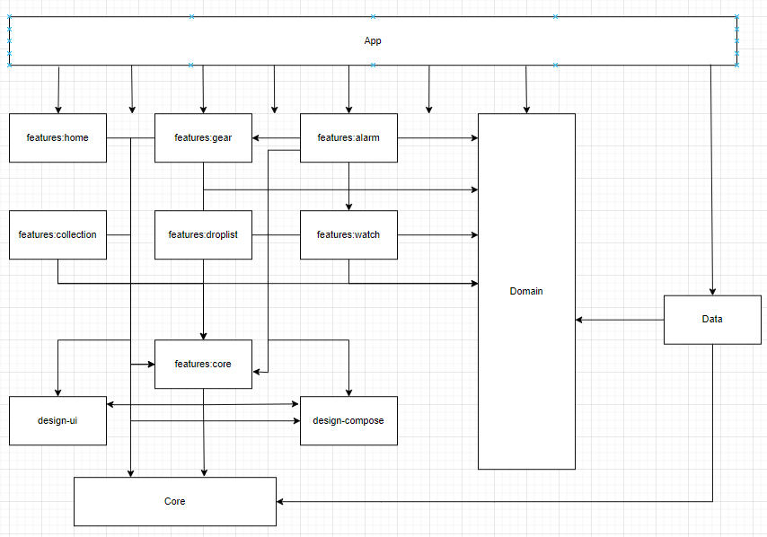

자세한 설명은 [깃블로그](https://jowunnal.github.io/categories/#projects "블로그 링크") 에 있습니다.

# 앱 소개

글로벌 모바일 게임 ‘아이모’ 의 팬메이드 앱으로써 아이모를 즐기는 유저들이 게임을 할때 필요한 정보들을 보여주고, 몬스터가 재생성(Regeneration) 될 때를 간편하게 알람 설정하는 등 게임을 하는데 유용한 기능들을 제공해주는 앱 입니다.

지역화(필리핀어, 미국어, 한국어) 되어 글로벌로 출시되었고, 다크테마와 폴더블 디바이스에 최적화 하였으며, 배너 및 리워드광고와 인앱 업데이트, 인앱결제가 포함된 실 서비스를 운영중인 앱 입니다.

# Why?

모바일 게임 아이모는 MMORPG 이며, 필드에서 PK 가 가능한 게임 입니다. 게임의 특성상 모든 필드의 보스 몬스터들은 길드 단위로 경쟁하고 있습니다. 여러 유저가 모여 만들어진 길드에서는 과거 “메신저봇R” 을 이용하여 몬스터 재 생성 시간을 자동으로 계산하고 유저들이 모두 볼 수 있도록 채팅방 “공지” 로 설정하고 있었습니다. 하지만 “나는 원숭이다” 사건 이후 카카오에서 카톡봇에 대한 제재 수위를 높이고 업데이트로 원활한 “메신저봇R” 의 이용이 불가 해지면서 대안이 필요해졌고, 몬스터 알람 뿐만 아니라 게임 유저들 에게 더 나은 가치를 제공해 줄 수 있는 안드로이드 앱 개발을 시작하게 되었습니다.

# 주요 기능

- **몬스터 도감** : 사용자는 사냥터를 기준으로 해당 지역의 출몰 몬스터를 상세 조회할 수 있다.
- **아이템 도감** : 사용자는 카테고리(무기, 방어구, 잡템, 코스튬) 기준으로 분류된 아이템을 상세 조회 및 필터링 할 수 있다.
- **몬스터 알람** : 아이모 내 보스 몬스터들의 재생성 시간을 계산하지 않고 편리하게 알람을 생성 할 수 있다.
- **현재시간 항상 보기 기능** : 사용자는 "다른앱 위에 그리기" 로 현재시간과 등록된 몬스터 알람 시간을 선택적으로 함께 볼 수 있다.
- **길드 마크 변환 기능** : 앱 외부 저장소의 이미지 파일을 가져와 갤러리 형태로 노출하고, 사용자가 임의로 선택하여 해당 이미지를 12*12 픽셀로 변환할 수 있다.
- **강화 시뮬레이터** : 사용자는 랜덤 수치의 스텟을 가진 무기, 방어구 아이템을 획득할 수 있고, Drag-And-Drop 으로 강화할 수 있다.
- **AI 길드 마크 이미지 생성 기능** : Dalle3 API 를 활용하여, 로그인 한 유저가 최적화된 프롬프트로 길드 마크로 변환할 이미지를 생성할 수 있다.
- **회원 정보 기능** : 인앱결제가 필요한 AI 길드 마크 이미지 생성 과 길드 마크 변환 기능을 서버로 저장하기 위해 Firebase-Storage 를 이용하고, 유저를 식별하기 위해 Firebase-Authentication 을 이용하여 로그인 및 회원관리를 제공한다.

# Stacks

| Category | Skill Set |
| ----- | ----- |
| Language | Kotlin |
| UI toolkit | Compose |
| Architecture | Clean Architecture |
| Design Pattern | MVVM |
| Android Component | Activity, Service, BroadcastReceiver |
| Jetpack | Lifecycle, Navigation(Compose), AlarmManager |
| Asynchronous | Kotlinx.Coroutines, Kotlinx.Coroutines.Flow |
| Dependency Injection | Hilt |
| Data | Room, DataStore(proto3) |
| Google | InAppPurchase, InAppUpdate, Admob |
| Firebase | Firebase-Analytics, Firebase-Storage, Firebase-RealtimeDatabase, Firebase-Crashlytics |
| Unit Test | Junit, Kotest, mockk |

# 개발 기간

**2022.01** ~ **현재진행중**

# Diagram

### Module Dependency

### Database Logical Design

# As-Is / Challenge / To-Be

안드로이드 백그라운드 정책 과 배터리 정책 가이드라인에 따라 몬스터 알람 기능을 구현하고 단위테스트 작성

### As-Is
- 몬스터 이름을 Spinner에서 선택한 뒤 "추가하기" 버튼을 누르면 “자주 사용하는 몬스터 리스트”에 등록된다.
  - 등록된 몬스터들은 버튼으로 노출되며, 클릭하면 죽은 시간을 입력할 수 있는 NumberPicker 가 BottomSheet 로 노출된다.
  - 죽은 시간을 입력한 뒤 "시작하기" 버튼을 누르면 몬스터의 재 생성 시간을 계산한 뒤 **알람을 생성**한다.
- 생성된 알람들은 현재 진행중인 알람 내역에서 조회할 수 있다.
- 몬스터 알람 간격은 NumberPicker 로 변경할 수 있다. 기본적으로 두개의 알람이 각각 5분, 10분 전 으로 생성된다.
- 사용자가 선택하여 현재시간과 함께 등록된 몬스터 알람의 재생성 시간을 Overlay 로 볼 수 있다.
- 알람은 지정된 시간에 Notification 을 생성하고, Notification 에서는 "알람 재생성" 버튼으로 현재 시간을 기준으로 몬스터 알람을 재 생성 할 수 있다.
- 알람을 생성하기 위한 비즈니스 로직에 대한 검증을 위해 단위테스트를 작성한다.

### Challenge
- 알람 생성
  - 몬스터의 재 생성 시간은 최대 7일 까지 걸릴 수 있고, 앱이 **백그라운드**에 있거나 디바이스가 **도즈모드**에 진입해도 **정시** 에 울려야 함
  - 따라서 **AlarmManager#setAlarmClock** 으로 알람을 생성하고, **BroadcastReceiver** 에서 수신하여 **Notification** 을 발생시킴
    - **BroadcastReceiver** 는 onReceive 콜백을 빠르게 실행시킨 뒤, 프로세스가 종료되기 때문에 알람 데이터 저장 및 재설정 작업은 별도의 백그라운드용 Service 로 데이터 전달 후 실행
- 알람 생성 로직
  - 입력 받은 몬스터 이름으로, Database 에서 몬스터 정보를 가져와 재 생성 시간을 현재 시간을 기준으로 계산하여 AlarmManager#setAlarmClock 으로 알람을 생성
  - 몬스터 이름으로 "등록되어 있는 알람 리스트" 에 있다면, update 없다면, insert
  - 알람이 생성 완료되었다면 Dialog 를 띄워주고, "등록되어 있는 알람 리스트" 목록을 갱신
- 알람 재 생성
  - **Notification**에 "알람 재생성" Action 추가, **PendingIntent#getService** 으로 백그라운드용 서비스를 실행하여 알람을 재 생성
    - Notification은 별도의 프로세스인 NotificationService 에서 intent 를 실행하기 때문에 PendingIntent 가 필수적이며, Scheduling API 를 사용할 수 없음 
    - BroadcastReceiver 에서 처리하기에 알람 생성 및 알람 리스트 DB 쿼리 로직의 소요 시간이 길기 때문에 특성상 적합하지 않아 Service 이용
    - 또한, 알람 재생성은 백그라운드에서 Notification에 의해 실행되므로 foregroundService 를 요청할 수 없으므로 백그라운드용 Service 이용
- 단위테스트 작성
  - 알람 생성 로직에 대해 kotlin 언어 기반 라이브러리인 **mockk** 로 주입하고, **kotest** 이용하여 단위테스트 작성 및 실행

### To-Be
- 몬스터 알람 생성에 대한 편리한 사용자 경험을 제공할 수 있었습니다.
- 백그라운드 작업의 실행에 적합한 컴포넌트와 API 를 선택하고, 활용할 수 있게 되었습니다.
- 백그라운드 작업이 배터리와 사용자 경험에 영향을 줄 수 있고, 이에 따른 구글의 제약 및 대안의 방향과 같은 전반적 안드로이드 생태계에 대해 학습하였습니다.
- 앱의 핵심 기능에 대해 단위테스트의 중요성을 깨닫았고, 테스트 가능한 코드를 작성하기 위한 의존성 주입과 추상화 전략에 대해 학습했습니다.

데이터들을 개념 및 논리 설계하여 데이터베이스 구축 후 Jetpack Room 이용, DB Migration 대응 및 테스트 작성

### As-Is
- 몬스터 도감, 아이템 도감, 몬스터 알람, 강화 시뮬레이터 기능에 사용할 데이터들이 필요하다.

### Challenge
- 데이터 저장은 Local **Database** 선택
  - 클라이언트 기반의 앱으로, 서버로 부터 데이터를 요청하지 않음
  - **DataStore** 를 사용하기에는 너무 많고 복잡한 데이터
  - 따라서, **Database**로 데이터를 저장하고 관리하는 방법을 선택
- Database 활용으로 **Jetpack Room** 선택
  - 안드로이드의 DBMS 는 **SQLite**
  - **SQLite** 를 직접 이용하기에는 많은 상용구로 **보일러 플레이트** 가 발생하고, Migration 과 같은 **DB 관리에 어려움**이 존재
  - **어노테이션**으로 보일러 플레이트를 줄이고, **Kotlinx.Coroutines 를 지원**하여 DB 관리에 다양한 API 를 제공해주는 **JetPack Room** 을 선택
  - [직접 개념적 설계](https://jowunnal.github.io/projects/%EC%95%84%EC%9D%B4%EB%AA%A8%EC%9E%A1%ED%95%99%EB%8F%84%EA%B5%AC_1.7.2_%EC%97%85%EB%8D%B0%EC%9D%B4%ED%8A%B8/ "link")로 **E-R 다이어그램**을 산출후 논리적 설계로 테이블 관계도를 구성
- Room DB Migration
  - 리펙토링 과정에 DB에 **중대한 변경점들이 크게 발생**하여 **수동이전** 코드를 작성하고, **crash 를 방지하기 위해** Migration 에 대한 테스트 작성 후 수행

### To-Be
- 앱내에서 Local 데이터를 저장하는 방법인 **SharedPerferences**, **DataStore** 와 **Room** 에 대해 학습했고, 상황에 따라 적절히 선택할 수 있게 되었습니다.

Dalle3 를 이용한 AI 이미지 생성형 기능 구현

### As-Is
- 사용자들이 길드 마크로 변환하기 위해 별도의 이미지들을 가져와야 했다.
- 이미지를 가져오지 않고, 서비스 내에서 이미지를 생성하고 변환하기 까지의 솔루션을 제공할 필요가 있다.

### Challenge
- 이미지 생성형 AI 로 Dalle3 활용
  - 생성형 AI 는 온디바이스 혹은 서버기반의 서드파티를 활용해야 하는데, 온디바이스로 처리하기에 이미지처리 학습모델의 크기가 경량화 되어도 GB단위로 너무 크다는 단점 존재
  - 앱 번들과 함께 배포하기 에는 Google Play 정책상 맞지 않고, 클라이언트 기반의 서비스기 때문에 Google Cloud 와 같은 서드파티를 이용해야 하는데, 업로드 및 다운로드의 양이 너무 크다는 단점 존재
  - 따라서, 다른 생성형 AI 와는 달리 이미지의 경우 서버기반의 API 를 활용해야 했고, 가격과 성능이 괜찮은 Dalle3 를 선택
- Dalle 는 파인튜닝이 불가능
  - Dalle 는 이미지를 생성 범용 모델이고, 길드 마크에 이용될 원하는 형태의 이미지를 생성하기 어려운 문제 발생
  - 따라서, 사용자가 입력한 텍스트 프롬프트와 길드 마크에 이용될 형태로 추가의 프롬프트를 함께 API로 전달하여 최적화
- Dalle 이용의 비용 문제
  - Dalle 를 이용하는데는 비용이 들기 때문에, Firebase-Realtime Database 와 인앱결제를 통해 사용횟수를 얻도록 구현
  - 결제한 유저의 사용횟수와 결제한 길드마크 정보를 저장하는 용도로 유저를 식별할 필요가 있기 때문에 Firebase-Authentication 을 이용한 회원관리를 구현
- 채팅 형태의 UX
  - 일반적인 생성형 AI 와 유사한 채팅 형태의 UX 제공(무한스크롤, 스크롤바, 입력 채팅 바 등)
  - 사용자가 EditTextField 에 프롬프트를 입력하면, 최적화된 프롬프트로 이미지를 요청하고, Coil 로 노출
- 이미지 요청 및 저장
  - OkHttpClient 로 이미지 요청 후, 파일서버의 url 을 노출하고, ContentResolver 로 앱 외부의 저장소에 이미지를 저장
  - 비동기로 수행하기 위해 Kotlinx.Coroutines 활용
### To-Be
- 이미지 변환 뿐만 아니라, 생성까지의 솔루션을 제공하여 더 나은 사용자 경험을 제공할 수 있게 되었습니다.
- 최적화된 http 요청 및 응답을 책임지는 OkHttpClient 와 http 메소드나 요청 및 응답을 객체로의 변환에 대한 추상화로 더 편리하고 보일러 플레이트를 줄여주는 Retrofit 에 대해 학습할 수 있었습니다.
- 생성형 AI 에 관한 전반적인 지식들을 얻고 경험할 수 있었습니다.

사용자가 디바이스 내의 선택한 이미지를 12*12 픽셀로 변환 하는 기능 구현

### As-Is
- 앱 외부의 디바이스 저장 공간에 있는 이미지들을 커스텀 갤러리 화면에 노출한다.
    - 갤러리의 모든 이미지들은 확대하기 버튼이 함께 노출되며, 클릭시 상세 이미지 화면으로 전환된다.
    - 100개 단위의 이미지를 페이징 처리하여 **무한 스크롤**로 가져온다.
    - 갤러리에는 **스크롤 바** 와 "최상단으로 이동하기" 버튼이 있다.
- 사용자는 임의의 이미지를 클릭하면, "길드 마크 심볼 화면"으로 이동한다.
- "길드 마크 심볼 화면"에서 이미지의 원본과 함께 12*12 픽셀로 변환된 작은 크기의 미리보기를 제공한다.
- 사용자는 미리보기 이미지를 확인하고 변환을 원한다면, 변환하기 버튼을 누른다.
- 변환을 위해서는 인앱 결제가 실행되며, 결제가 완료 되면 다음 4가지가 노출된다.
    - 이미지의 변환된 12*12 픽셀
        - 12*12 픽셀들은 인게임에서 함께 보기 위해 Overlay 로 노출된다.
    - 사용된 색상들을 “색상 팔레트”로 노출
        - 색상 팔레트에 있는 색상을 클릭하면, 해당 색상이 사용된 픽셀만 표시된다.
    - 색상들을 공통화 하기 위한 “색상 정밀도” 의 입력 SeekBar
        - 색상 정밀도에 따라 색상 팔레트의 색상이 공통화 되어 노출된다.
    - 12*12 픽셀로 변환된 작은 형태의 미리보기

### Challenge
- 커스텀 갤러리
  - why?
    - 안드로이드 14 버전 부터 앱 외부의 저장소로 부터 이미지를 가져오는 권한에 대한 제한이 강화되면서 특별한 사용사례가 아니면 **Photo Picker** 를 사용하는 것이 강제
    - 하지만 "길드 마크 심볼 생성" 기능은 앱의 핵심 기능이고, 사용자의 접근이 빈번하게 이루어질 수 있으며, 이미지에 대한 변환을 수행하는 기능이 제공되기 때문에 READ_MEDIA_IMAGES 권한 사용 승인
    - 또한 Dynamic 한 UI Component 를 개발하고자 하는 목적이 있었으므로 **Photo Picker** 대신 **커스텀 갤러리**를 구현하는 방법을 선택
  - How?
    - **READ_MEDIA_IMAGES** 와 안드로이드 14 버전 이상 이라면 추가로 **READ_MEDIA_VISUAL_USER_SELECTED** 에 대한 권한을 요청
    - 승인된 권한에 맞게 앱 외부의 저장소로 부터 **ContentResolver** 로 가장 최근에 수정된 이미지 순서대로 100개를 가져옴
    - 갤러리 LazyList 의 한 아이템 view size 에 이미지 개수를 곱하여 **스크롤 바의 위치**를 계산하여 표시
    - "최상단으로 이동하기" 버튼을 클릭시 **LazyListState#animateScrollToItem** 으로 이동
    - 버튼과 스크롤바는 **코루틴을 활용한 타이머**로 3초간 스크롤이 발생하지 않으면 자동으로 사라지도록 구현
- 결제
  - 인앱 결제는 **gms** 의 **InAppPurchase** 를 이용
- 12*12 픽셀의 이미지 변환
  - 사용자가 선택한 이미지의 contentURI 로 **ImageDecoder#decodeBitmap** 을 이용하여 비트맵 객체를 생성
  - 해당 비트맵을 **Bitmap#createScaledBitmap** 을 이용하여 12*12 픽셀 로 변환
  - 변환된 비트맵을 **Bitmap#getPixels** 을 이용하여 색상 배열을 추출하고, 색상 정밀도 범위 내에서 비슷한 **색상들을 공통화** 하여 노출
    - 비슷한 색상들을 공통화 하는 이유는 UX를 고려하여 육안으로 구분하기 힘들 정도의 비슷한 색상들이 "색상 팔레트" 에 나뉘어져 존재하는 문제 때문
    - **색상 공통화 알고리즘**
      - "색상 팔레트" 로 담을 리스트를 생성
      - 12*12 크기의 변환된 색상 배열에 대해 완전 탐색
        - 해당 색상과 "색상 팔레트" 리스트의 색상들과의 rgb 값 차이가 "색상 정밀도" 수치 범위 내에 있다면 리스트에 추가하지 않고 반복을 종료
        - 색상 리스트의 끝까지 없다면, 리스트에 추가
      - 마지막으로 "색상 팔레트" 리스트를 rgb 값 순서대로 정렬하여 반환

### To-Be
- **Bitmap(래스터)** 과 **Vector(백터)** 이미지 파일 포맷의 종류인 **png, jpg, webp, svg** 에 대한 장단점 및 차이를 알고 적용할 수 있었습니다.
  - 기존의 png 이미지를 구글에서 개발한 webp 이미지로 변환하여 앱의 크기를 경량화 할 수 있었습니다. (R8 활성화와 함께 앱크기 기존 65mb -> 20mb으로 약 70% 개선)
- **android.graphics.Bitmap** 의 다양한 API 들을 활용하면서 **이미지 처리에 대한 이해**를 넓힐 수 있었습니다.

 
# UI

### 몬스터 도감

https://github.com/user-attachments/assets/4d696520-1b30-4461-8b9d-33bf462cd38a

### 아이템 도감

https://github.com/user-attachments/assets/a504ef63-807f-44cf-89de-c569d927b852

### 길드마크 심볼

https://github.com/user-attachments/assets/812ede40-702f-4d9f-b6ce-15047ca50a22

### 몬스터 알람

https://github.com/user-attachments/assets/7c8a1346-ee18-46ac-a06f-be0dc61d3ca4
