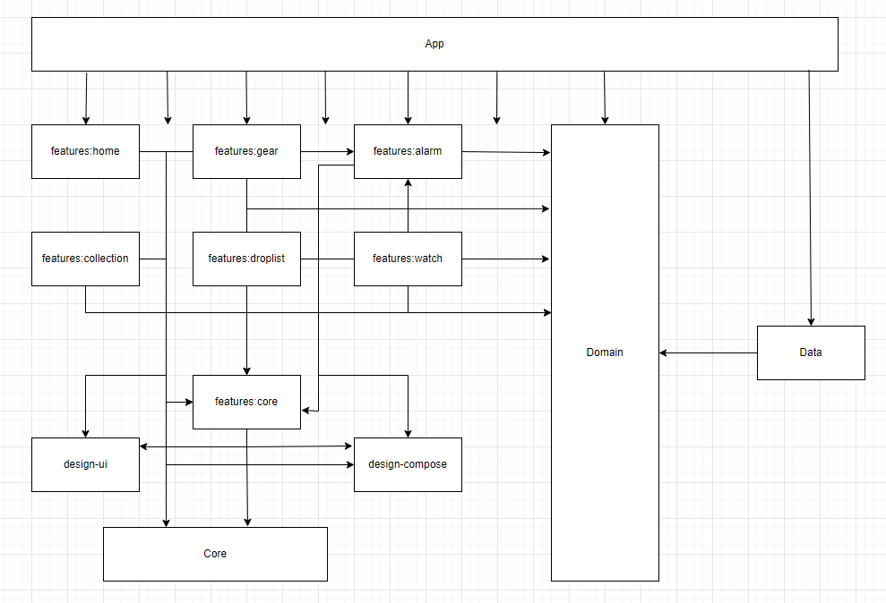
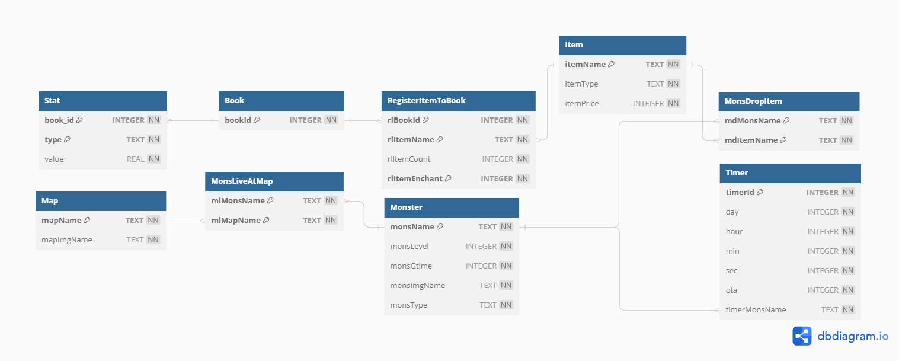
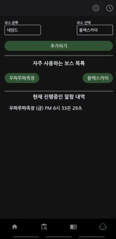
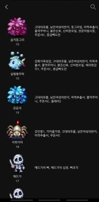
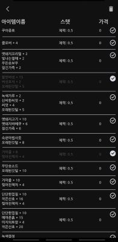
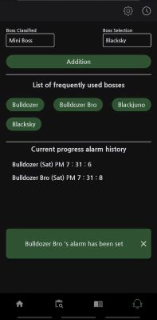
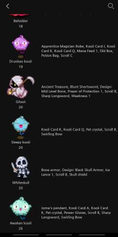
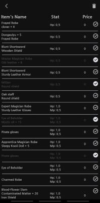

자세한 설명은 [깃블로그](https://jowunnal.github.io/categories/#projects "블로그 링크") 에 있습니다.

# Introduction

모바일 게임 아이모를 플레이 하기에 편리한 기능을 제공해주는 앱 입니다.

사용자는 몬스터와 도감의 정보를 편리하게 확인할 수 있으며,

몬스터가 죽고 난 뒤 재생성 시간을 계산할 필요 없이 편리하게 알람을 설정할수 있으며,

화면의 Overlay 기능을 통해 지속적으로 현재시간과 몬스터 재생성 시간을 확인할 수 있습니다.

현재 필리핀어, 미국어 에 대응하여 해외마켓과 한국마켓에 출시한 상태이며, 

배너 및 리워드광고와 인앱결제가 포함된 어플입니다.

# Operations

- **몬스터 도감** : 사용자는 아이모 사냥터(Map) 기준으로 해당 지역 출몰 몬스터를 상세 조회할 수 있다.
- **아이템 도감** : 사용자는 카테고리(무기류, 방어구류, 잡템[소비품]류, 코스튬[치장품]류) 기준으로 분류된 아이템 을 상세 조회와 제거 및 되돌리기를 수행할 수 있다.
- **알람 조회** : 아이모 내 보스 몬스터들의 재생성(Regeneration) 시간을 등록 및 관리 할 수 있다. 사용자는 본인이 원하는 보스 몬스터를 자주 사용하는 몬스터 리스트에 등록한뒤 알람을 생성하고, 삭제하고, 조회할 수 있다.
- **현재시간 항상 보기 기능** : 사용자는 모바일 디바이스 화면 상단에 현재시간을 원하는 폰트 크기와 위치시킨뒤 몬스터의 재생성 시간과 함께 확인할 수 있다.

# Stacks

 - Kotlin
 - Compose & AndroidView
 - Kotlin.Coroutines.Flow
 - Databinding
 - Navigation ( Single Activity )
 - Room
 - DataStore
 - AlarmManager
 - Service
 - BroadcastReceiver
 - Hilt
 - GooglePlay(In-App-Purchase)
 - Admob
 - Notification

# Point

- DB 개념&논리 설계 후 Room Library 사용하여 DML(Data Manipulation Lanage) 로 통신
- 안드로이드 백그라운드 정책 가이드라인에 따라 Notification 으로 알람 기능 구현
- 스파게티 코드에서 MVVM & Clean 아키텍쳐 적용하여 모듈화
- LiveData → Coroutines.Flow & AndroidView 일부를 Compose로 Refactoring
- 재사용 가능한 단위의 UI Component로 나누어 코드 개선
- 안드로이드 뷰 계층구조와 Compose의 View 생성 과정을 이해하여, UI에 필요한 커스텀 뷰 생성
- ListAdapter와 RecyclerView로 정보들을 보여주고, 갤러리 처럼 삭제 기능 구현
- Foreground Service에서 Overlay 로 현재시간과 진행중인 몬스터 알람 노출
- Localization 으로 다국어(미국,필리핀,한국) 마켓 서비스 & 다크테마 대응
- PlayStore에 출시(2022.03) 하여 지속적으로 User 의 FeedBack으로 개선 작업

# Architecture ( Clean + MVVM )

### Detail

### Module

### Database Logical Design

# Skill changed

 - AndroidView -> Compose (일부 혼용 - 두가지 방법 모두 알아야 하기 때문)
 - LiveData -> Flow
 - SharedPreferences -> DataStore ( proto3 )
 - Spaghetti -> Google Recommened Architecture -> Clean Architecture
 
# UI

  

  

# Past Release Version History

### 1.0~1.2
- 알람을 정확한시간동작 에서 5분전 동작으로 변경후 재등록

### 1.3
- 도감내 코스튬 이 추가
- 기존 도감버튼클릭시 바로 전체도감 출력 에서 도감분류fragment 추가후 분류View에서 잡탬류,무기류,코스튬류 를 선택하여 볼수있도록 분류View 추가
- 알람부분 UI구성을 좀더 보기좋게 정렬함

### 1.4
- 알람부분에서 보스타입 spinner 선택후 타입에따른 몬스터들을 나타내는 spinner 에서 보스타입이 named는 정상동작하지만, boss와 bigboss선택시 named 보스를 알람설정됨
- 데이터베이스내용에 일부 미지원하는 몬스터들에대해 타입을 변경해서 spinner에 나오지않도록 변경함

### 1.5.0~1.5.1
- 드랍몹(대형보스급)빅마마,우크파나,바슬라프,일루스트,마녀딜린 추가
- 알람화면 UI구성 추가 (화면중앙에 젠타임표기&제거&전체ON/OFF)
- 날짜단위 추가 및 24시 넘어갓던버그해결
- 현재진행중인 알람내역 요일-시-분-초 순으로 정렬기능추가
- 특정기기의 UI 가로넓이 짤리는부분 개선

### 1.5.2
- 알람이 5분전 단일알람에서 5분전,0분전 두가지로 변경되었습니다.
- 화면상단의 등록된 몬스터에대한 타이머출력이 일-시-분-초 순으로 정렬됩니다.
- 화면상단에 현재시간항상출력이 추가되었습니다. 개별적으로 on/off할수없습니다.
- 도감부분의 UI가 개선되었습니다. 아이탬개수가 1개일때는 더이상표기되지 않습니다.
- 알람부분의 버튼이름들이 더 직관적으로 변경되었습니다.

### 1.5.3
- 화면위에 타이머출력부분이 게임내UI와 겹쳐져 잘보이지 않던 이슈가 개선되었습니다.
- on/off 버튼을통해 등록된타이머가 없어도 현재시간을 출력할수 있습니다.
- 타이머가 모두 제거되어도, 현재시간은 계속 출력되도록 변경되었습니다.

### 1.5.4
- 화면위에그리기 Overlay 활성화 중에 업데이트 발생시 ANR 발생하는 이슈 해결

### 1.6.2
- 화면 UI구성이 전체적으로 변경되었습니다.
- 서버기능이 개설되었습니다.
- 알람발생시 알람의 액션버튼을 통해 즉시 타이머등록이 가능해졋습니다.

### 1.7.2
 - 전체적인 UI 구성이 변경되었습니다.
 - 서버기능이 삭제되었습니다.
 - 신규몬스터, 아이템도감이 대응되었습니다.

__이후 버전은 Release로 관리하였습니다.__
