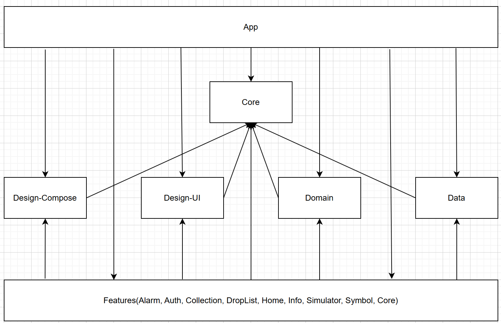

자세한 설명은 [깃블로그](https://jowunnal.github.io/categories/#projects "블로그 링크") 에 있습니다.

# Introduction

모바일 게임 아이모를 플레이 하기에 편리한 기능을 제공해주는 앱 입니다.

사용자는 몬스터와 도감의 정보를 편리하게 확인할 수 있으며,

몬스터가 죽고 난 뒤 재생성 시간을 계산할 필요 없이 편리하게 알람을 설정할수 있으며,

화면의 Overlay 기능을 통해 지속적으로 현재시간과 몬스터 재생성 시간을 확인할 수 있고,

인게임 내에서 길드마크를 편리하게 만들 수 있도록 원하는 이미지를 12*12 픽셀로 변환할 수 있습니다.

지역화(필리핀어, 미국어, 한국어) 되어 글로벌로 출시되었으며, 

배너 및 리워드광고와 인앱 업데이트, 인앱결제가 포함된 어플입니다.

# Operations

- **몬스터 도감** : 사용자는 아이모 사냥터(Map) 기준으로 해당 지역 출몰 몬스터를 상세 조회할 수 있다.
- **아이템 도감** : 사용자는 카테고리(무기류, 방어구류, 잡템[소비품]류, 코스튬[치장품]류) 기준으로 분류된 아이템 을 상세 조회와 제거 및 되돌리기를 수행할 수 있다.
- **알람 조회** : 아이모 내 보스 몬스터들의 재생성(Regeneration) 시간을 등록 및 관리 할 수 있다. 사용자는 본인이 원하는 보스 몬스터를 자주 사용하는 몬스터 리스트에 등록한뒤 알람을 생성하고, 삭제하고, 조회할 수 있다.
- **현재시간 항상 보기 기능** : 사용자는 모바일 디바이스 화면 상단에 현재시간을 원하는 폰트 크기와 위치시킨뒤 몬스터의 재생성 시간과 함께 확인할 수 있다.
- **길드 마크 생성 기능** : 사용자의 갖고 있는 이미지 파일을 가져와 갤러리 형태로 노출하고, 사용자가 임의로 선택하여 해당 이미지를 12*12 픽셀로 변환할 수 있다.

# Stacks

| Category | Config |
| ----- | ----- |
| Language | Kotlin |
| UI toolkit | XML, Compose |
| Android Component | Activity, Service, BroadcastReceiver |
| Jetpack | Lifecycle, Navigation, AlarmManager, Databinding |
| Asynchronous | Kotlin.Coroutines, Kotlin.Coroutines.Flow |
| Dependency Injection | Hilt |
| Data | Room, DataStore(proto3) |
| Google | InAppPurchase, InAppUpdate, Admob |
| Unit Test | Junit, Kotest, mockk |

# Architecture ( Clean + MVVM )

### Detail

### Module

### Database Logical Design

 
# UI

## 몬스터 도감

## 아이템 도감

## 길드마크 심볼

## 몬스터 알람

