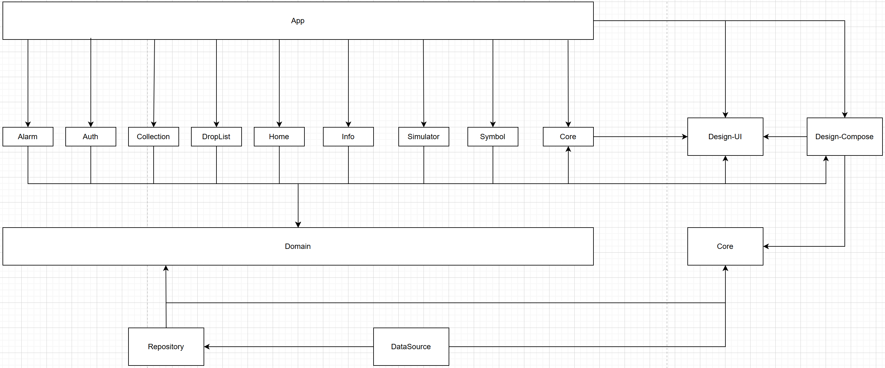

# 개발 기간

- 서비스 운영 기간: **2022.01** ~ **2025.04**
- 실 소요 기간: 약 1년 6개월

# 앱 소개

글로벌 모바일 게임 ‘아이모’ 의 팬메이드 앱으로써 아이모를 즐기는 유저들이 게임을 할때 필요한 정보들을 보여주고, 몬스터가 재생성(Regeneration) 될 때를 간편하게 알람 설정하는 등 게임을 하는데 유용한 기능들을 제공해주는 앱 입니다.

지역화(필리핀어, 미국어, 한국어) 되어 글로벌로 출시되었고, 다크테마와 폴더블 디바이스에 최적화 하였으며, 배너 및 리워드광고와 인앱 업데이트, 인앱결제가 포함된 실 서비스를 2022년 부터 운영중인 앱 입니다.

# Why?

모바일 게임 아이모는 MMORPG 이며, 필드에서 PK 가 가능한 게임 입니다.  게임의 특성상 모든 필드의 보스 몬스터들은 길드 단위로 경쟁하고 있습니다. 

여러 유저가 모여 만들어진 길드에서는 과거 몬스터의 재 생성 시간을 일부 유저가 직접 계산하여 카카오톡의 단체방에 공지 설정을 했었습니다.

이 때, 계산 과정에서 실수가 발생하여 잘못된 시간으로 착각하게 되는 일이 발생했고 길드 내 갈등을 초래했습니다. 

이후 저는 재발을 방지하기 위해 [“메신저봇R” 을 이용하여 몬스터 재 생성 시간을 자동으로 계산](https://github.com/jowunnal/2021_bossTimeManager_2 "link")하고 유저들이 모두 볼 수 있도록 채팅방 공지 로 설정하여 해결했었습니다. 

하지만, 당시 "메신저봇R" 의 내부적 원인으로 인해 장시간 이용시 먹통이 되는 문제가 있었을 뿐만 아니라, 카카오 측에서 __나는 원숭이다__ 사건 이후 카톡봇에 대한 제재 수위가 높아지게 되었습니다. 

이를 해결하기 위해 '몬스터 알람' 뿐만 아니라 게임을 이용하는데 편리하고 실용적인 기능을 제공함으로써 __더 나은 가치를 제공해 주기 위해 안드로이드 앱 개발 공부를__ 시작하게 되었고, 2022년 3월에 첫 출시를 할 수 있었습니다.

# 주요 기능

- **몬스터 도감** : 사용자는 사냥터를 기준으로 해당 지역의 출몰 몬스터를 상세 조회할 수 있다.
- **아이템 도감** : 사용자는 카테고리(무기, 방어구, 잡템, 코스튬) 기준으로 분류된 아이템을 상세 조회 및 필터링 할 수 있다.
- **몬스터 알람** : 아이모 내 보스 몬스터들의 재생성 시간을 계산하지 않고 편리하게 알람을 생성 할 수 있다.
- **현재시간 항상 보기 기능** : 사용자는 "다른앱 위에 그리기" 로 현재시간과 등록된 몬스터 알람 시간을 선택적으로 함께 볼 수 있다.
- **길드 마크 변환 기능** : 앱 외부 저장소의 이미지 파일을 가져와 갤러리 형태로 노출하고, 사용자가 임의로 선택하여 해당 이미지를 12*12 픽셀로 변환할 수 있다.
- **강화 시뮬레이터** : 사용자는 랜덤 수치의 스텟을 가진 무기, 방어구 아이템을 획득할 수 있고, Drag-And-Drop 으로 강화할 수 있다.
- **AI 길드 마크 이미지 생성 기능** : Dalle3 API 를 활용하여, 로그인 한 유저가 최적화된 프롬프트로 길드 마크로 변환할 이미지를 생성할 수 있다.
- **회원 정보 기능** : 인앱결제가 필요한 AI 길드 마크 이미지 생성 과 길드 마크 변환 기능을 서버로 저장하기 위해 Firebase-Storage 를 이용하고, 유저를 식별하기 위해 Firebase-Authentication 을 이용하여 로그인 및 회원관리를 제공한다.

# Stacks

| Category | Skill Set |
| ----- | ----- |
| Language | Kotlin |
| UI toolkit | Compose |
| Architecture | Clean Architecture |
| Design Pattern | MVVM |
| Android Component | Activity, Service, BroadcastReceiver |
| Jetpack | Lifecycle, Navigation(Compose), AlarmManager, WindowManager |
| Asynchronous | Kotlinx.Coroutines, Kotlinx.Coroutines.Flow |
| Dependency Injection | Hilt |
| Data | Room, DataStore(proto3), Retrofit2, Okhttp3|
| Google | InAppPurchase, InAppUpdate, Admob |
| Firebase | Firebase-Analytics, Firebase-Storage, Firebase-RealtimeDatabase, Firebase-Crashlytics |
| Unit Test | Junit, Kotest, mockk |
| CI/CD | Github Actions |

# As-Is / Challenge / To-Be

Clean Architecture, MVVM, UDF, 단일 상태 관리로의 구조 설계

### As-Is
- 장기간 사용자의 피드백을 기반으로 기능을 확장하고 유지보수 해오는 과정에서 작성한 코드들의 응집도와 결합도 문제로 인해 유지보수를 하기 어려워졌습니다.
- 사용자가 점진적으로 늘어나고 그에 따라 기능을 확장하는 과정에서, 작동이 되지 않는 버그들이 발생했습니다.
  - 이를 해결하기 위해 핵심 기능들에 대해 단위테스트를 수행하여 방지 하려고 했습니다.
  - 하지만, 안드로이드 의존성이 존재하거나 특정 클래스에 다른 클래스가 결합되어 있는 경우 테스트가 어려워지는 문제가 발생했고, 테스트 코드를 작성하기 위해 코드를 수정해야 하는 이유 등으로 인해 테스트 코드 작성에 시간이 오래걸리는 문제가 발생했습니다.

### Challenge
- MVVM 패턴 적용
  - MVVM 패턴을 적용하여 __UI 와 비즈니스 로직의 관심사를 분리__ 함으로써 UI 와 데이터 각각의 변경이 서로에게 영향을 주지 않게 만들었습니다.
    - 비즈니스 로직에 대한 단위테스트의 가능성을 만들어 줄 수 있었습니다.
    - 가독성을 높일 수 있었고, 장기간 프로젝트를 진행하는 과정에서 오래된 코드를 다시 보아도 빠르게 이해한 뒤 유지보수 할 수 있었습니다.
  - 사용자의 행위에 의한 데이터의 변경은 __ViewModel 의 함수로 실행__ (캡슐화)되며, 함수의 결과로 인해 변경된 데이터를 UI 가 구독하여 갱신하는 __단방향 데이터 흐름__ 으로 인해 디버깅이 수월해졌습니다.
  - 하지만 Compose 를 이용하여 선언형 패러다임으로의 전환 후, UI 가 구독중인 상태의 수와 변경에 대한 함수가 많아지면서, 함수의 입력 매개변수의 양이 많아짐으로 인해 유지보수가 어려웠습니다.
    -  변경 불가능한 __단일 상태__ 를 만들어 UI 가 구독하도록 하고, 이벤트(상태에 대한 변경)를 sealed class 로 관리하여 입력 매개변수의 양을 줄이도록 개선했습니다.
- Clean Architecture 적용
  - 이 프로젝트의 목적은 [Why?](https://github.com/jowunnal/twom_miscellaneoustool?tab=readme-ov-file#why "link") 섹터에서 소개한 바와 같이, 아이모 라는 게임내에 존재하는 정보들(몬스터, 맵, 도감)과 이 정보들을 토대로 특정 기능들(알람, 강화시뮬레이션, 길드마크심볼생성)을 제공해 주는 것이 목적입니다.
  - 모바일 게임 아이모는 피쳐폰 부터 시작하여, 스마트폰 앱으로 약 15년간 운영되어온 게임입니다. 이 게임은 지난 약 15년 동안 몬스터, 캐릭터, 맵, 강화와 같은 __게임의 특성이 변화 없이 유지한 상태로__ 추가적 기능과 UX 개선을 진행해 왔습니다.
  - 따라서, __불변적 특성(몬스터, 캐릭터, 맵, 강화 등)들을 기반으로 도메인 주도 설계를__ 적용하기 적합했고, 
  - 안드로이드 뿐만 아니라 KMM 을 이용하여 IOS 와 데스크탑으로의 확장을 염두해두고 있기 때문에 Clean Architecture 에서 가장 중요시되는 __도메인 기반의 의존성 규칙을__ 적용하기에 적합했습니다.
  - 이에 따라 순수 코틀린으로 작성되는 도메인 모듈을 모바일 게임 아이모의 불변적 특성을 기반으로 설계했고, 플랫폼 의존성을 기반으로 Presentation(Feature) 모듈과 Data(Repository, DataSource) 모듈이 도메인을 의존하도록 구성하였습니다.
    - Data 모듈의 경우 데이터 입출력은 상대적으로 빈번하게 변경되어 왔기 때문에 DataSource 를 분리한 뒤, 의존성 역전을 이용하여 Repository <- DataSource 구조로 설계했습니다.
    - 이를 통해 데이터 입출력의 변경은 DataSource 의 변경으로만 영향을 주게 되고, 모듈을 분리함으로써 Repository 모듈의 재빌드를 요구하지 않아 빌드 타임을 개선할 수 있었습니다.

### To-Be
- 장기간 확장 및 유지보수 되어 프로젝트의 규모가 점점 커지면서 발생했던 __기능을 확장하고 유지보수 하기 어려운__ 문제들을 해결할 수 있었습니다.
- 구조를 잘 나누고 설계하여 핵심 기능들에 대해 __테스트 가능성__ 을 만들었고, 핵심 기능들에 대한 단위테스트를 수행하여 안정성을 높일 수 있었습니다.
- 도메인 주도 설계가 필요한 Clean Architecture 에서는 도메인이 재대로 설계되지 않아 변경되는 경우 모든 모듈에 영향을 줄 수 있기 때문에 도메인이 처음부터 잘 설계되는 것이 중요하다는 점을 깨닫았고, 소규모의 프로젝트나 외부에서 비즈니스가 처리된 데이터를 받을 경우 적합하지 않을 수 있다는 점을 알게 되었습니다.

안드로이드 백그라운드 정책 과 배터리 정책 가이드라인에 따라 몬스터 알람 기능을 구현하고 단위테스트 작성

### As-Is
- 사용자가 직접 몬스터의 죽은 시간에 재 생성까지 걸리는 시간을 더하고, 이를 시스템 알람 앱에 설정하는 과정이 번거롭다.
- 게다가, 가끔 사용자가 계산 실수를 하여 다음 몬스터의 재 생성을 놓치는 경우가 빈번하다.

몬스터의 죽은 시간만 입력하면 간편하게 몬스터의 재 생성 시간을 알람으로 설정해주고, 직관적으로 등록된 알람 리스트를 보여주면 어떨까?

### Challenge
- 알람 생성
  - 몬스터의 재 생성 시간은 최대 7일 까지 걸릴 수 있고, 앱이 **백그라운드**에 있거나 디바이스가 **도즈모드**에 진입해도 **정시** 에 울려야 함
  - 따라서 **AlarmManager#setAlarmClock** 으로 알람을 생성하고, **BroadcastReceiver** 에서 수신하여 **Notification** 을 발생
- 알람 재 생성
  - 알람 재 생성 로직은 Service 로 분리하고, Notification 에 Service 를 호출하는 "알람 재생성" Action 추가
    - **BroadcastReceiver** 내에서 상대적으로 **작업을 수행하는데 오랜 시간이 소요되는**  I/O 나 CPU-consuming 한 작업을 실행하기 적합하지 않음
    - 따라서 알람 데이터 저장 및 재설정 작업은 별도의 **백그라운드용 Service** 로 데이터 전달 후 실행
      - Scheduling API 는 왜 못쓰는가?
        - Notification은 별도의 프로세스인 **NotificationService** 에서 intent 를 실행하기 때문에 **PendingIntent** 가 필수적이며, Scheduling API 를 사용할 수 없음
      - ForegroundService 는 왜 못쓰는가?
          - ForegroundService 는 **백그라운드에서 실행할 수 없기 때문**
- 단위테스트 작성
  - 알람 생성 로직에 대해 kotlin 언어 기반 라이브러리인 **mockk** 로 주입하고, **kotest** 이용하여 단위테스트 작성 및 실행

### To-Be
- 안드로이드에서의 백그라운드 제약(배터리 타임, 눈에 보이지 않아 사용자가 실행 중 인지 알 수 없는 문제)을 이해하고, 백그라운드 작업 가이드를 학습하여 올바른 API 를 선택할 수 있게 되었습니다.
- 앱의 핵심 기능에 대해 단위테스트의 중요성을 깨닫았고, 테스트 가능한 코드를 작성하기 위한 의존성 주입과 추상화 전략에 대해 학습했습니다.
- 결과적으로 몬스터 알람 생성에 대한 편리한 사용자 경험을 제공할 수 있었습니다.

앱에 필요한 데이터들을 개념 및 논리 설계하여 릴레이션 생성한 뒤, Jetpack Room 활용 및 DB Migration 대응과 테스트 작성

### As-Is
- 몬스터 도감, 아이템 도감, 몬스터 알람, 강화 시뮬레이터 기능에 사용할 데이터들이 필요하다.

### Challenge
- 데이터 저장은 Local **Database** 선택
  - 클라이언트 기반의 앱으로, 서버로 부터 데이터를 요청하지 않음
  - **DataStore** 를 사용하기에는 너무 많고 복잡한 데이터
  - 따라서, **Database**로 데이터를 저장하고 관리하는 방법을 선택
- Database 활용으로 **Jetpack Room** 선택
  - 안드로이드의 DBMS 는 **SQLite**
  - **SQLite** 를 직접 이용하기에는 많은 상용구로 **보일러 플레이트** 가 발생하고, Migration 과 같은 **DB 관리에 어려움**이 존재
  - **어노테이션**으로 보일러 플레이트를 줄이고, **Kotlinx.Coroutines 를 지원**하여 DB 관리에 다양한 API 를 제공해주는 **JetPack Room** 을 선택
  - [직접 개념적 설계](https://jowunnal.github.io/projects/%EC%95%84%EC%9D%B4%EB%AA%A8%EC%9E%A1%ED%95%99%EB%8F%84%EA%B5%AC_1.7.2_%EC%97%85%EB%8D%B0%EC%9D%B4%ED%8A%B8/ "link")로 **E-R 다이어그램**을 산출후 논리적 설계로 테이블 관계도를 구성
- Room DB Migration
  - 리펙토링 과정에 DB에 **중대한 변경점들이 크게 발생**하여 **수동이전** 코드를 작성하고, **crash 를 방지하기 위해** Migration 에 대한 테스트 작성 후 수행

### To-Be
- 앱내에서 Local 데이터를 저장하는 방법인 **SharedPerferences**, **DataStore** 와 **Room** 에 대해 학습했고, 상황에 따라 적절히 선택할 수 있게 되었습니다.

Dalle3 를 이용한 AI 이미지 생성형 기능 구현

### As-Is
- 사용자들이 길드 마크로 변환하기 위해 별도의 이미지들을 가져와야 했다.
- 이미지를 가져오지 않고, 서비스 내에서 이미지를 생성하고 변환하기 까지의 솔루션을 제공할 필요가 있다.

### Challenge
- 이미지 생성형 AI 로 Dalle3 활용
  - 생성형 AI 는 온디바이스 혹은 서버기반의 서드파티를 활용해야 하는데, 온디바이스로 처리하기에 이미지처리 학습모델의 크기가 경량화 되어도 GB단위로 너무 크다는 단점 존재
  - 앱 번들과 함께 배포하기 에는 Google Play 정책상 맞지 않고, 클라이언트 기반의 서비스기 때문에 Google Cloud 와 같은 서드파티를 이용해야 하는데, 업로드 및 다운로드의 양이 너무 크다는 단점 존재
  - 따라서, 다른 생성형 AI 와는 달리 이미지의 경우 서버기반의 API 를 활용해야 했고, 가격과 성능이 괜찮은 Dalle3 를 선택
- Dalle 는 파인튜닝이 불가능
  - Dalle 는 이미지를 생성 범용 모델이고, 길드 마크에 이용될 원하는 형태의 이미지를 생성하기 어려운 문제 발생
  - 따라서, 사용자가 입력한 텍스트 프롬프트와 길드 마크에 이용될 형태로 추가의 프롬프트를 함께 API로 전달하여 최적화
- Dalle 이용의 비용 문제
  - Dalle 를 이용하는데는 비용이 들기 때문에, Firebase-Realtime Database 와 인앱결제를 통해 사용횟수를 얻도록 구현
  - 결제한 유저의 사용횟수와 결제한 길드마크 정보를 저장하는 용도로 유저를 식별할 필요가 있기 때문에 Firebase-Authentication 을 이용한 회원관리를 구현
- 채팅 형태의 UX
  - 일반적인 생성형 AI 와 유사한 채팅 형태의 UX 제공(무한스크롤, 스크롤바, 입력 채팅 바 등)
  - 사용자가 EditTextField 에 프롬프트를 입력하면, 최적화된 프롬프트로 이미지를 요청하고, Coil 로 노출
- 이미지 요청 및 저장
  - OkHttpClient 로 이미지 요청 후, 파일서버의 url 을 노출하고, ContentResolver 로 앱 외부의 저장소에 이미지를 저장
  - 비동기로 수행하기 위해 Kotlinx.Coroutines 활용
### To-Be
- 이미지 변환 뿐만 아니라, 생성까지의 솔루션을 제공하여 더 나은 사용자 경험을 제공할 수 있게 되었습니다.
- 최적화된 http 요청 및 응답을 책임지는 OkHttpClient 와 http 메소드나 요청 및 응답을 객체로의 변환에 대한 추상화로 더 편리하고 보일러 플레이트를 줄여주는 Retrofit 에 대해 학습할 수 있었습니다.
- 생성형 AI 에 관한 전반적인 지식들을 얻고 경험할 수 있었습니다.

디바이스 내부에 존재하거나, Dalle3 로 생성된 이미지를 12*12 픽셀로 변환 하는 기능 구현

### As-Is
- 이미지 Source
  - 디바이스 내부이면서, 앱 외부의 저장소에 존재하는 이미지 파일(Content uri)
  - AI 이미지 생성형 기능을 통해 생성된 이미지의 download url
  - Firebase-Storage 에 저장된 이미지의 download url

이미지를 인게임 환경에서 활용할 수 있는 **길드 마크 심볼(12*12 칸의 픽셀)** 형태로 변환한 뒤에 Overlay 로 보여줌으로 써 편리한 UX를 제공해야 한다.

### Challenge
- 이미지의 비트맵 객체 가져오기
  - 이미지는 Android#Bitmap 으로 변환하여 처리하며, 내부적으로 12*12 픽셀 형태로 변환하는 등의 **픽셀 처리**가 필요하므로 변경 가능한 **Software 타입의 Bitmap** 객체를 이용
  - Content Uri
    - **READ_MEDIA_IMAGES** 와 안드로이드 14 버전 이상 이라면 추가로 **READ_MEDIA_VISUAL_USER_SELECTED** 에 대한 권한을 요청
    - 승인된 권한에 맞게 앱 외부의 저장소로 부터 **ContentResolver** 로 가장 최근에 수정된 이미지 순서대로 100개를 가져옴
    - 사용자가 선택한 이미지의 contentURI 로 **ImageDecoder#decodeBitmap** 을 이용하여 비트맵 객체를 생성
  - Http Url
    - 이미지의 uri 가 "http" 문자로 시작하는지 확인한다.
    - 해당하는 경우, **Coil#ImageLoader** 로 요청하여 이미지를 가져온 뒤, Software 비트맵 타입으로 캐스팅
- 12*12 픽셀의 이미지 변환
  - 가져온 비트맵을 **Bitmap#createScaledBitmap** 을 이용하여 12*12 픽셀 로 변환
  - 변환된 비트맵을 **Bitmap#getPixels** 을 이용하여 색상 배열을 추출하고, 색상 정밀도 범위 내에서 비슷한 **색상들을 공통화** 하여 노출
    - 비슷한 색상들을 공통화 하는 이유는 UX를 고려하여 육안으로 구분하기 힘들 정도의 비슷한 색상들이 "색상 팔레트" 에 나뉘어져 존재하는 문제 때문
    - **색상 공통화 알고리즘**
      - "색상 팔레트" 로 담을 리스트를 생성
      - 12*12 크기의 변환된 색상 배열에 대해 완전 탐색
        - 해당 색상과 "색상 팔레트" 리스트의 색상들과의 rgb 값 차이가 "색상 정밀도" 수치 범위 내에 있다면 리스트에 추가하지 않고 반복을 종료
        - 색상 리스트의 끝까지 없다면, 리스트에 추가
      - 마지막으로 "색상 팔레트" 리스트를 rgb 값 순서대로 정렬하여 반환

### To-Be
- **Bitmap(래스터)** 과 **Vector(백터)** 이미지 파일 포맷의 종류인 **png, jpg, webp, svg** 에 대한 장단점 및 차이를 알고 적용할 수 있었습니다.
  - 기존의 png 이미지를 구글에서 개발한 webp 이미지로 변환하여 앱의 크기를 경량화 할 수 있었습니다. (R8 활성화와 함께 앱크기 기존 65mb -> 20mb으로 약 70% 개선)
- **android.graphics.Bitmap** 의 다양한 API 들을 활용하면서 **이미지 처리에 대한 이해**를 넓힐 수 있었습니다.

Compose 로 무한 스크롤 가능하고, 스크롤 바 가 표시되는 갤러리 화면 개발

### As-Is

- 사용자의 기기 내부 저장소에 저장된 이미지들을 가져와서 갤러리 형태로 노출해야 한다.
- 시스템 갤러리 앱을 오마주 하여 **무한 스크롤** 가능하고, **스크롤 바** 가 존재하는 갤러리 컴포넌트가 필요하다.
- 개별 이미지는 **확대될 수 있어야 하고**, 클릭 시 상세 이미지 화면으로 전환할 수 있어야 한다.

### Challenge
- 커스텀 갤러리
  - why?
    - 안드로이드 14 버전 부터 앱 외부의 저장소로 부터 이미지를 가져오는 권한에 대한 제한이 강화되면서 특별한 사용사례가 아니면 **Photo Picker** 를 사용하는 것이 강제
    - 하지만 "길드 마크 심볼 생성" 기능은 앱의 핵심 기능이고, 사용자의 접근이 빈번하게 이루어질 수 있으며, 이미지에 대한 변환을 수행하는 기능이 제공되기 때문에 READ_MEDIA_IMAGES 권한 사용 승인
    - 또한 Dynamic 한 UI Component 를 개발하고자 하는 목적이 있었으므로 **Photo Picker** 대신 **커스텀 갤러리**를 구현하는 방법을 선택
  - How?
    - [Scrollable Layout](https://github.com/jowunnal/twom_miscellaneoustool/blob/master/design/src/main/kotlin/com/jinproject/design_compose/component/lazyList/ScrollableLayout.kt "link") 컴포넌트 구현
      - LazyList 의 한 아이템에 대한 view height 에 이미지 개수를 곱하여 **스크롤 바의 위치**를 계산하여 표시
        - 스크롤 바에 Modifier#pointerInput 으로 Drag를 observing 하여, Drag amount 만큼 lazyListState#scrollBy 트리거
      - "최상단으로 이동하기" 버튼을 클릭시 **LazyListState#animateScrollToItem** 트리거
      - "최상단으로 이동하기" 버튼과 스크롤바는 **[코루틴을 활용한 타이머](https://github.com/jowunnal/twom_miscellaneoustool/blob/master/design/src/main/kotlin/com/jinproject/design_compose/component/lazyList/TimeScheduler.kt "link")**로 3초간 스크롤이 발생하지 않으면 자동으로 사라지도록 구현
    - [Scrollable Layout](https://github.com/jowunnal/twom_miscellaneoustool/blob/master/design/src/main/kotlin/com/jinproject/design_compose/component/lazyList/ScrollableLayout.kt "link") 을 활용한 [Gallery](https://github.com/jowunnal/twom_miscellaneoustool/blob/master/features/symbol/src/main/kotlin/com/jinproject/features/symbol/gallery/component/ImageList.kt "link") 컴포넌트 구현
- 무한 스크롤
  - User Interaction 은 기본적으로 Root View 에서 최하위 Leaf View 까지 전달된 후, **Leaf View 에서 부터 소비**하고, **소비되지 않은 interaction 을 상위 view 가 소비**할 수 있음
    - 갤러리 컴포넌트는, Root > Scrollable Layout > LazyList(Gallery) > GalleryItem 구조
    - 이를 이용하여, LazyList 에서 **소비되지 않은 스크롤**이 발생하면 다음 페이지를 가져옴
- 갤러리 이미지 페이징
  - **[restartableStateIn](https://github.com/jowunnal/twom_miscellaneoustool/blob/master/features/core/src/main/kotlin/com/jinproject/features/core/utils/StateFlowUtils.kt "link")** 으로 발행된 변경 불가능한 StateFlow 를 View 에서 구독
  - inital value 를 방출하지 않기 위해 **SharingCommand#STOP 후 SharingCommand#START** 로 다음페이지 요청
  - 가져왔던 마지막 이미지의 "수정된 시각"을 **메모리에 캐싱**해 뒀다가, 다음 페이지의 요청이 오면 이용

### To-Be
- View hierarchy 내에서 User Interaction 이 어떻게 전파되고, 소비되는지에 대한 동작 구조를 이해할 수 있었습니다.
- Slot API 패턴을 이용하여, 재사용 가능하고, 너무 작지않되 너무 큰 역할을 하지 않는 적절한 구조로 UI Component 를 개발하고 이용하였습니다.
- configuration change 및 화면 전환에도 스크롤과 같은 상태를 유지하기 위해 rememberSaveable 을 적극적으로 이용 하였고, 적절한 상태 관리 방법들을 적용하였습니다.

Github Actions 활용하여 CI/CD 환경 구축 

### As-Is
- 기존 코드를 리펙토링 할 때 마다, 단위테스트 실행을 별도로 진행해 주어야 한다.
- 개발이 끝나고 릴리즈를 위해 Master 브랜치에 push 할 때 마다 반복되는 작업들을 일일이 수행해 주어야 한다.
  - versionCode 를 증가한 뒤, 릴리즈 빌드로 aab 생성
  - 생성된 aab를 플레이콘솔에 배포
  - Release 노트 작성
  - readme 에 노출되는 버전들 최신화

### Challenge
- Develop 브랜치에 CI 환경 구축
  - 신규 기능이나 코드 작성이 수행되면, Develop 브랜치에 push 해야 하므로, Develop 에 push 할 때 마다 반복되는 작업(lint 검사, 테스트 실행)을 수행하도록 CI 구축
  - 코드는 항상 IDEA 에서 개발후 빌드로 실행까지 해보기 때문에 CI에서 시간이 오래걸리는 Build 를 실행해줄 필요는 없으므로 필요한 작업들만 실행
- Master 브랜치에 CD 환경 구축
  - Master 브랜치에 push 될 때, Release 인지 아니면 다른 이유로 push 된 것인지 1차적으로 검사하기 위해 커밋 메세지를 검사
  - Release: X.X.X 로 작성된 메세지라면, 다음 작업들을 직렬로 실행
    - 1. Release Build 후 .aab 생성
    - 2. VersionCode 증가
    - 3. Release Build, aab Signing
    - 4. Play Console 에 aab 배포
    - 5. 릴리즈 노트 생성
    - 6. Readme 업데이트
  - Develop 브랜치에서 실행된 테스트나 lint 검사를 다시 할 이유가 없으므로 해당 작업을 실행하지 않음

### To-Be
- 반복적인 작업들을 자동화하여 실수를 방지하고, 개발 생산성을 높일 수 있었습니다.
- 개발 외의 작업들은 자동화 되어 편리성이 증가하고 개발에 더 집중할 수 있게 되었습니다.

# Diagram

### Module Dependency

### Database Logical Design

 
# UI

### 몬스터 도감

https://github.com/user-attachments/assets/0580bdba-5d51-4637-a7a9-fd66da3edc02

### 아이템 도감

https://github.com/user-attachments/assets/a714a720-dd96-4980-907f-415854904280

### 길드마크 심볼

https://github.com/user-attachments/assets/812ede40-702f-4d9f-b6ce-15047ca50a22

### 몬스터 알람

https://github.com/user-attachments/assets/7190e7da-1dae-4e9a-965c-e4980b3e28c7

### 강화 시뮬레이터

https://github.com/user-attachments/assets/4fb741a0-d136-4470-b28a-d3fa795edb76

# Details

더 자세한 히스토리는 [깃블로그](https://jowunnal.github.io/categories/#projects "블로그 링크") 에 있습니다.
